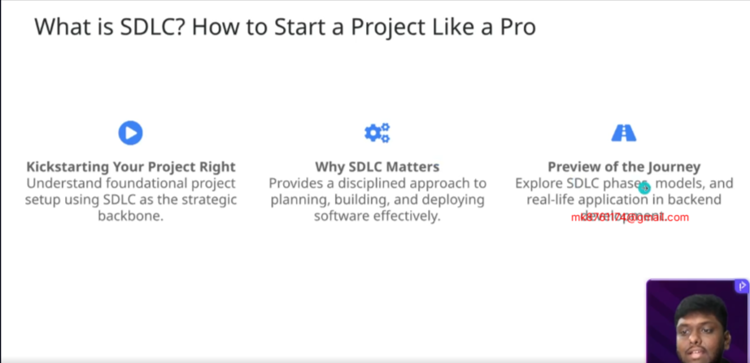
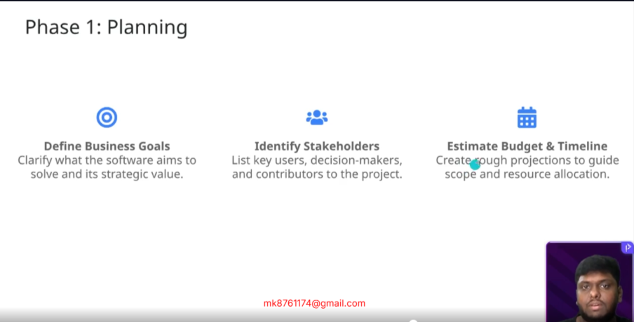
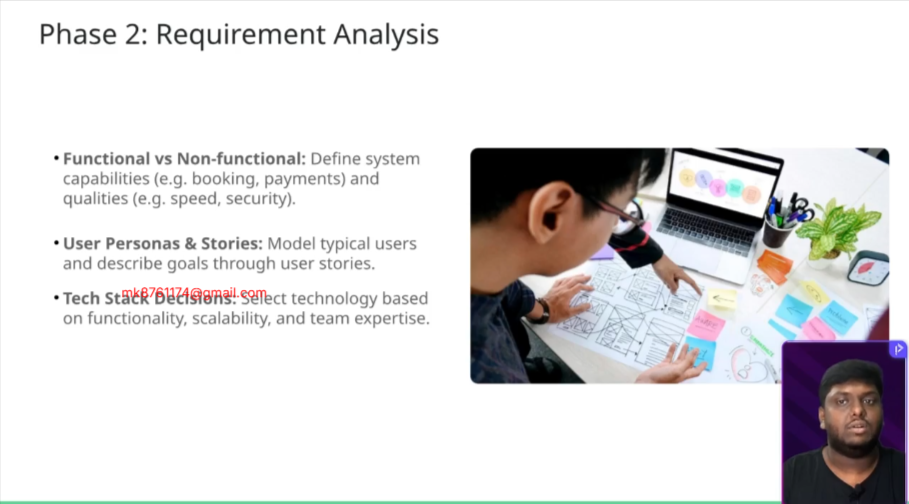
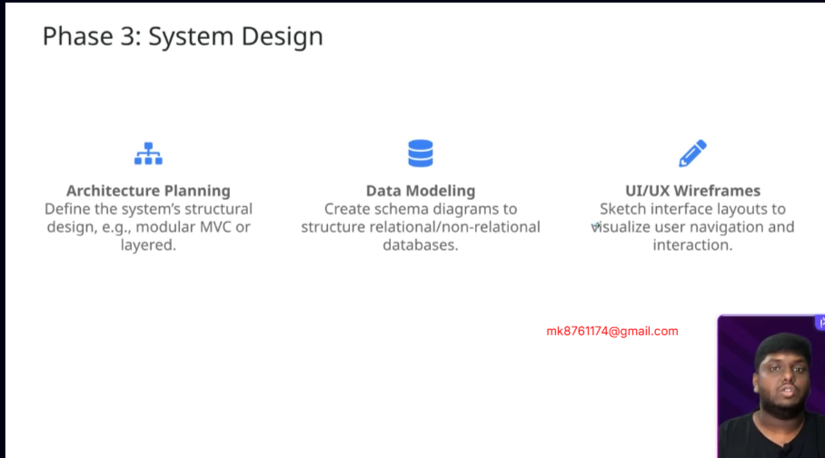
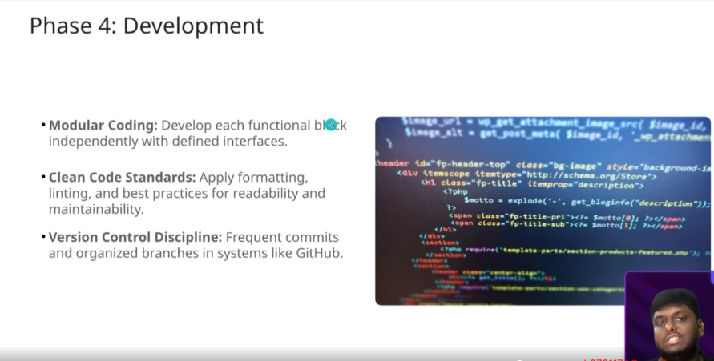
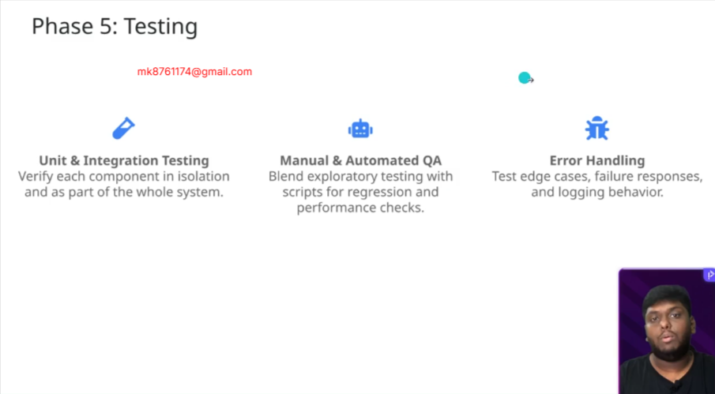
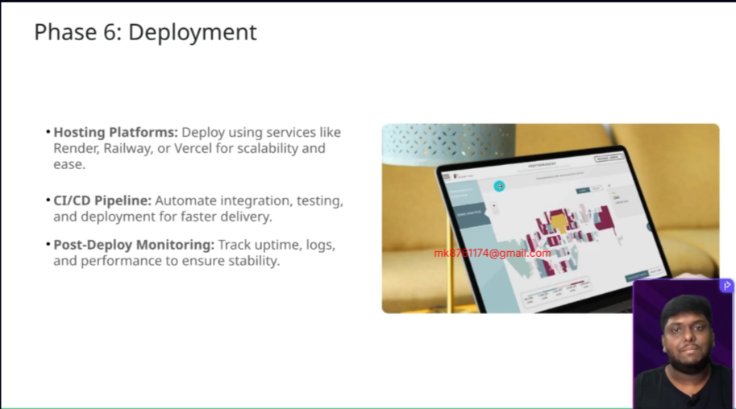
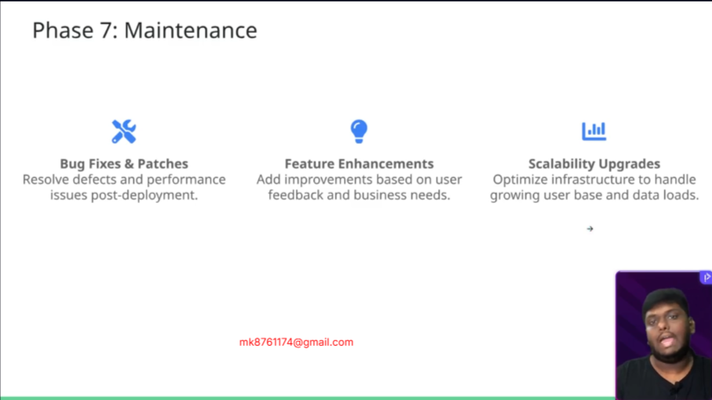
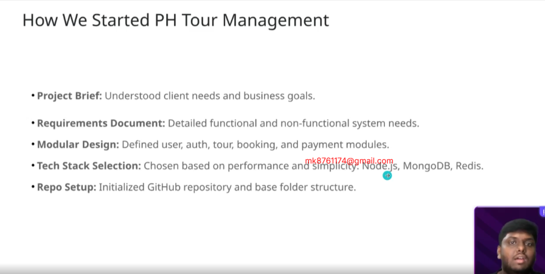

## Requirement Analysis - PH Tour Management System Backend

https://docs.google.com/document/d/1XRN18ClObPMJGKl7CfZFBLeZuJf2h8JOBc_crzuWtT4/edit?tab=t.0

Workflow of the PH Tour Management System 

https://gitmind.com/app/docs/mzkbj5o2

PH Tour Management System Data Modelling

https://docs.google.com/document/d/1NSELQ7_jUx4xLGchef4HT3_9YqDWrdzUUGMZWmD2lY0/edit?tab=t.0

ER Diagram for PH Tour Management System

https://drive.google.com/file/d/1ASphx7B6gHIKPiiiNf3AB_ZTvdYRBsQz/view?usp=sharing

PNG Format of ER Diagram for PH Tour Management System

https://drive.google.com/file/d/1KspyCQ992oAw1dDhIzRtK8-q5jnhWG0z/view?usp=drive_link

PH Tour Management System API Endpoints

https://docs.google.com/document/d/1HysoioRCpSsGpSz8JQZRGii9GNkpdx0pEX-zHP2p334/edit?tab=t.0

GitHub Repository

https://github.com/Apollo-Level2-Web-Dev/ph-tour-management-system-backend

Project Setup Branch

https://github.com/Apollo-Level2-Web-Dev/ph-tour-management-system-backend/tree/project-setup

Development Branch

https://github.com/Apollo-Level2-Web-Dev/ph-tour-management-system-backend/tree/development# Industry-Maestro-Ph-Tour-project-setupManagement-

## 25-1 What is SDLC, How we should start a Project
- SDLC stands for Software Development Life Cycle. It is a structured process used by software developers and project managers to design, develop, test, and deploy high-quality software efficiently. and ast deploy and hand over to customer 

The most popular SDLC project approaches used today, especially in modern software development, are:

- 🔥 1. Agile Model (Most Popular Today)
🔄 Key Features:
Iterative and incremental

Focus on collaboration, customer feedback, and rapid delivery

Divides the project into small cycles called sprints (usually 1–4 weeks)

Suitable for changing requirements

✅ Best For:
Startups, dynamic projects, web/mobile apps, frequent updates

🔧 Example:
A food delivery app is continuously improved based on user feedback after each sprint.

- 💧 2. Waterfall Model
📐 Key Features:
Sequential approach – one phase is completed before the next starts

Easy to understand and manage

No overlap between phases

❌ Limitation:
Not flexible to changes once the development starts

✅ Best For:
Well-defined, small to medium-sized projects with fixed requirements (e.g., government or defense systems)

- 🔁 3. Iterative Model
🔁 Key Features:
Starts with basic functionality, then adds features in cycles

Feedback after each iteration helps improve the next version

✅ Best For:
Projects where full requirements are not known upfront

💡 4. Spiral Model
🔄 Key Features:
Combines iterative development with risk analysis

Each phase involves risk assessment, planning, and testing

✅ Best For:
Large, complex, and high-risk projects (e.g., banking software)

- ✅ 5. DevOps Approach (Modern Practice)
🔧 Key Features:
Merges development and operations teams

Focuses on automation, continuous integration (CI), and continuous delivery (CD)

Fast and frequent deployments

✅ Best For:
Cloud-based apps, SaaS platforms, large-scale systems
#### We are working on agile model

  

- How We Started Ph Tour Management

## 25-2 Requirement Analysis of PH Tour Management System
#### Project Name: PH Tour Management System Backend
Version: 1.0
Prepared By: Next Level Team
1. Introduction
1.1 Purpose
To develop a scalable, secure, and user-friendly web application that allows users to book tours across Bangladesh, while providing admin and management capabilities for tour operators.
1.2 Scope
The system will include modules for:
- User registration and authentication
- Tour listing and filtering
- Booking and payment processing
- Admin panel for managing users, tours, guides, and transactions
- Integration with SSLCommerz for online payments
1.3 Definitions, Acronyms, Abbreviations
JWT - JSON Web Token for authentication
RBAC - Role-Based Access Control
CRUD - Create, Read, Update, Delete
SPA - Single Page Application
2. Overall Description
2.1 Product Perspective
This is a modular and service-oriented backend designed to be consumed by any frontend (React, Next.js, etc.).
2.2 User Classes and Characteristics
Visitor - Unauthenticated users browsing tours
User - Registered users booking tours
Admin - Manages users, tours, bookings
3. Functional Requirements
FR1: User can register using email / Google.
FR2: OTP is sent and must be verified to activate account.
FR3: Users can log in using credentials / Google.
FR4: Authenticated users can view and update their profile.
FR5: Admin can list, update, or deactivate users.
FR6: Admin can create, update, delete tours.
FR7: Tours must include title, description, division, price, images.
FR8: Users can browse and search tours.
FR9: Users can filter by division, price, keywords.
FR10: Users can view detailed tour info.
FR11: Authenticated users can book a tour with a date.
FR12: System creates a booking with status `pending`.
FR13: Users can view their booking history.
FR14: Admin can update booking status (confirm, cancel).
FR15: Initiate payment through SSLCommerz.
FR16: Handle success and failure redirects.
FR17: Update payment and booking status post-validation.
FR18: Admin can manage tours, users, and bookings.
FR19: Admin can assign guides to tours.
FR20: Admin can manage division listings.
4. Non-Functional Requirements
NFR1: System should respond within 500ms for 95% of requests.
NFR2: Should support at least 1,000 concurrent users.
NFR3: Backend should be horizontally scalable.
NFR4: Passwords must be hashed (e.g., bcrypt).
NFR5: JWT tokens must be securely stored and validated.
NFR6: Role-based access control (RBAC) must be enforced.
NFR7: Payment data must be securely transmitted using HTTPS.
NFR8: System must ensure 99.5% uptime.
NFR9: Redis used for transient data like OTPs must be fault-tolerant.
NFR10: Code should be modular and follow MVC architecture.
5. System Architecture Overview
Backend: Node.js (Express), MongoDB, Redis
Frontend: React/Next.js (separate)
Auth: JWT, OTP via SMS/Email
Payment: SSLCommerz
Deployment: Vercel
6. External Interface Requirements
User Interface: Separate SPA frontend that consumes JSON APIs.
API Interface: RESTful APIs structured under `/api/v1`
Hardware Interface: Hosted on cloud or VPS (e.g., Vercel, AWS, DigitalOcean)
Software Interface: Compatible with MongoDB Atlas, Redis Cloud, or local deployments
7. Data Requirements
Key Entities:
- User: name, phone, email, password, role, verified
- Tour: title, description, price, images, division, slug
- Booking: userId, tourId, date, status, paymentStatus
- Payment: bookingId, transactionId, status, amount
8. Use Case Scenarios
Use Case: Booking a Tour
1. User registers and verifies via OTP.
2. User logs in and browses tours.
3. User selects a tour and submits booking.
4. System creates booking (status: pending).
5. User is redirected to SSLCommerz.
6. On payment success, booking is confirmed.
9. Acceptance Criteria
Users can register, log in, and book tours
Admin can manage tours, users, bookings
Payments update booking statuses correctly
All APIs are secured and role-protected
System meets NFRs for performance and security

